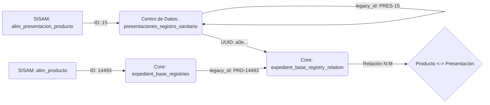

# Guía de Migración: Presentaciones de Productos (Data Expert Edition)

**Referencia Técnica** | **Estado**: `APPROVED` | **Fecha**: 2026-01-19
**Responsabilidad**: Data Engineering Team
**Objetivo**: Migrar presentaciones con trazabilidad absoluta y relaciones 1:1.

---

## 0. Prerrequisitos y Setup Inicial

Antes de ejecutar cualquier script, verificar que el entorno cumpla con las siguientes condiciones.

### 0.1 Dependencias de Base de Datos
*   **Extensiones**: `pgcrypto` activada en ambas bases de datos (Core y Centro de Datos) para generar UUIDs.
    ```sql
    CREATE EXTENSION IF NOT EXISTS pgcrypto;
    ```
*   **Permisos**: Usuario con privilegios de `DDL` (para alterar tablas) y `DML` (insert/update/delete) en schemas `public`.
*   **Conexiones**: Acceso simultáneo a:
    *   `SISAM` (Origen)
    *   `Centro de Datos` (Destino Intermedio/Catálogos)
    *   `CORE` (Destino Final)

### 0.2 Tablas Satélite (Dependencias Funcionales)
Las siguientes tablas deben existir y estar pobladas en **Centro de Datos**:
1.  **`srs_material`**: Catálogo de materiales de envase.
    *   *Verificación*: `SELECT count(*) FROM srs_material;` (> 0)
    *   *Campo Clave*: `legacy_id` (debe tener formato `MAT-{ID}`)
2.  **`srs_unidad_medida`**: Catálogo de unidades.
    *   *Verificación*: `SELECT count(*) FROM srs_unidad_medida;` (> 0)
    *   *Campo Clave*: `legacy_id` (debe tener formato `UM-{ID}`)

### 0.3 Tablas de Staging (Temporales)
Para que los scripts de migración (Fase 1) funcionen, deben existir y estar pobladas las siguientes tablas en **Centro de Datos**:

1.  **`migration_presentaciones`**: Contiene los datos crudos exportados de `alim_presentacion_producto`.
2.  **`migration_material_mapping`**: Tabla de mapeo para buscar UUIDs de materiales.
    *   *Origen*: Exportar IDs de `srs_material`.
3.  **`migration_unidad_mapping`**: Tabla de mapeo para buscar UUIDs de unidades.
    *   *Origen*: Exportar IDs de `srs_unidad_medida`.

*> Nota: Las tablas de migración de Marcas y Bodegas (`migration_marca_mapping`, etc.) **NO** son requeridas para este proceso específico, ya que las presentaciones son entidades independientes.*

### 0.4 Archivos y Scripts Requeridos
Asegurarse de tener localmente:
*   `scripts/07_migrate_presentaciones.sql`
*   `scripts/08_migrate_presentacion_relations.sql`
*   `scripts/08b_migrate_presentacion_relations_core.sql`

---

## 1. Arquitectura de Datos

El desafío principal es migrar una relación ternaria de SISAM (`producto` + `material` + `unidad`) a una entidad en Centro de Datos (`presentaciones_registro_sanitario`) y finalmente vincularla en Core (`expedient_base_registry_relation`).

### Flujo de Trazabilidad (`legacy_id`)



---

## 2. Estrategia "Clean Slate"

Para evitar la explosión de registros (producto cartesiano) detectada en iteraciones previas (21M registros erróneos), se implementa una estrategia de **regeneración controlada**:

1.  **Centro de Datos**: Se agrega `legacy_id` a `presentaciones_registro_sanitario`.
2.  **Limpieza**: Se truncan los datos existentes para eliminar duplicados "huerfanos".
3.  **Carga Maestra**: Se insertan datos usando `legacy_id` como clave de unicidad (‘PRES-ID_SISAM’).
4.  **Relacionamiento**: Se usa el `legacy_id` para generar el mapeo exacto hacia Core.

---

## 3. Fase 1: Centro de Datos (Catalogación)

### 3.1 DDL Update (Schema Evolution)

Modificación estructural necesaria para garantizar la unicidad e idempotencia.

```sql
-- Ejecutar en: Centro de Datos
ALTER TABLE presentaciones_registro_sanitario
ADD COLUMN IF NOT EXISTS legacy_id VARCHAR(50);

CREATE INDEX IF NOT EXISTS idx_presentaciones_legacy
ON presentaciones_registro_sanitario(legacy_id);
```

### 3.2 Extracción (ETL)

Exportar desde SISAM la fuente de verdad.

```sql
-- Ejecutar en: SISAM
SELECT DISTINCT
    pp.id AS id_presentacion,
    pp.cantidad AS unidad,
    pp.id_ctl_unidad_medida,
    mep.id_ctl_material,
    pp.id_alim_producto
FROM alim_presentacion_producto pp
JOIN alim_envase_producto ep ON ep.id = pp.id_alim_envase_producto
JOIN alim_material_envase_producto mep ON mep.id_alim_envase_producto = ep.id
JOIN alim_producto p ON p.id = pp.id_alim_producto
WHERE p.estado_registro = 1
  -- Filtros de calidad de datos
  AND p.num_registro_sanitario IS NOT NULL;
```
➡️ **Artifact**: `presentaciones.csv`

### 3.3 Carga y Transformación

Usamos tablas de staging (`migration_*`) para resolver relaciones con catálogos (`srs_material`, `srs_unidad_medida`).

**Script de Ejecución**: `scripts/07_migrate_presentaciones.sql`

Lógica crítica de inserción:
```sql
INSERT INTO presentaciones_registro_sanitario (..., legacy_id, ...)
SELECT
    gen_random_uuid(),
    'PRES-' || mp.id_presentacion, -- CLAVE DE TRAZABILIDAD
    ...
FROM migration_presentaciones mp ...
```

### 3.4 Data Quality Check

Validar que no existan duplicados funcionales.

```sql
SELECT legacy_id, COUNT(*)
FROM presentaciones_registro_sanitario
GROUP BY legacy_id HAVING COUNT(*) > 1;
-- Resultado esperado: 0 filas.
```

---

## 4. Fase 2: Core (Relacionamiento)

### 4.1 Generación de Mapping (Bridge)

Desde Centro de Datos, generamos el puente exacto entre UUIDs y Legacy IDs.

```sql
-- En Centro de Datos
SELECT
    prs.id AS presentacion_uuid,
    mp.id_alim_producto
FROM presentaciones_registro_sanitario prs
JOIN migration_presentaciones mp
    ON prs.legacy_id = 'PRES-' || mp.id_presentacion;
```
➡️ **Artifact**: `presentacion_producto_mapping.csv`

### 4.2 Ingesta de Relaciones

**Script de Ejecución**: `scripts/08b_migrate_presentacion_relations_core.sql`

En Core, cargamos el CSV a una tabla temporal y materializamos la relación.

```sql
INSERT INTO expedient_base_registry_relation (
    expedient_base_registry_id, relation_id, reference_name, ...
)
SELECT
    r.id,
    pm.presentacion_uuid,
    'presentaciones_registro_sanitario', -- Tabla destino
    ...
FROM migration_presentacion_mapping pm
JOIN expedient_base_registries r
    ON r.legacy_id = 'PRD-' || pm.id_alim_producto;
```

---

## 5. Validación Final (QA)

### 5.1 Conteo Cruzado (Cross-Database)

| Métrica | Query (Conceptual) | Valor Esperado |
|---------|--------------------|----------------|
| Origen SISAM | `SELECT COUNT(*) FROM alim_presentacion_producto` | **N** |
| Destino CD | `SELECT COUNT(*) FROM presentaciones_registro_sanitario` | **N** |
| Relaciones Core | `SELECT COUNT(*) FROM expedient_base_registry_relation WHERE reference_name='...'` | **N** |

*Nota: Pequeñas discrepancias pueden deberse a productos inactivos filtrados en el `WHERE` inicial.*

### 5.2 Muestreo de Integridad

Verificar un producto específico.

```sql
-- En Core
SELECT
    r.unique_code,
    r.name as producto,
    COUNT(rel.id) as presentaciones_migradas
FROM expedient_base_registries r
JOIN expedient_base_registry_relation rel ON rel.expedient_base_registry_id = r.id
WHERE rel.reference_name = 'presentaciones_registro_sanitario'
  AND r.legacy_id = 'PRD-14493' -- ID de prueba
GROUP BY r.id, r.unique_code, r.name;
```

---

## 6. Rollback / Disaster Recovery

En caso de fallo, ejecutar limpieza en orden inverso (Foreign Keys).

1.  **Core**: Eliminar relaciones.
    ```sql
    DELETE FROM expedient_base_registry_relation
    WHERE reference_name = 'presentaciones_registro_sanitario';
    ```

2.  **Centro de Datos**: Truncar presentaciones.
    ```sql
    TRUNCATE TABLE presentaciones_registro_sanitario;
    -- Opcional: Reiniciar secuencias si aplica
    ```

---

## 7. Anomalías Detectadas & Soluciones

| Anomalía | Impacto | Solución Aplicada |
|----------|---------|-------------------|
| **Duplicidad Material/Unidad** | Productos diferentes comparten misma combinación física. | Uso de `legacy_id` garantiza que cada registro físico sea único por presentación lógica. |
| **Explosión de Joins** | 21M de registros erróneos en intento previo. | Cambio de estrategia: Join por ID (`legacy_id`) en lugar de por atributos (`nombre`, `unidad`). |
| **Ids ambiguos** | Confusión entre IDs de producto y presentación. | Estandarización de prefijos: `PRD-` para productos, `PRES-` para presentaciones. |
