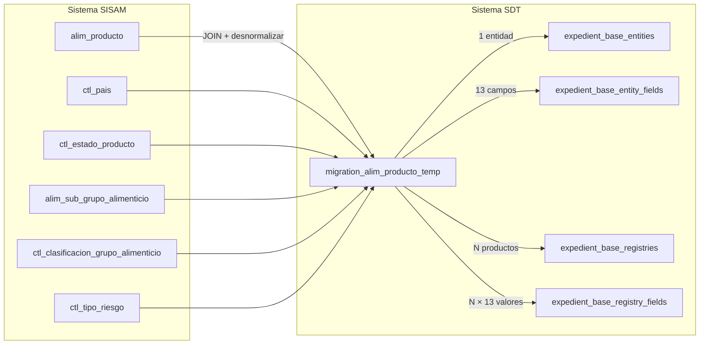

# T81 - Registro Sanitario Alimentos

## Contexto de Negocio

| Aspecto | Detalle |
|---------|---------|
| **Trámite** | 81 |
| **Objetivo** | Registro sanitario de alimentos y bebidas |
| **Alcance** | Solicitudes de registro ingresadas por regulados |
| **Regulador** | Superintendencia de Regulación Sanitaria (SRS) |
| **Unidad** | Unidad de Alimentos y Bebidas |

---

## Tablas Origen

| Tabla | Descripción |
|-------|-------------|
| `alim_producto` | Productos alimenticios nacionales e importados |
| `ctl_pais` | Catálogo de países |
| `ctl_estado_producto` | Catálogo de estados (Vigente, Bloqueado, Vencido) |
| `alim_sub_grupo_alimenticio` | Sub-grupos alimenticios |
| `ctl_clasificacion_grupo_alimenticio` | Clasificación de grupos alimenticios |
| `ctl_tipo_riesgo` | Tipos de riesgo (A, B, C) |

---

## Destino

- **Entidad**: `expedient_base_entities` → "T81 - Registro Sanitario Alimentos"
- **Campos**: `expedient_base_entity_fields`
- **Registros**: `expedient_base_registries`
- **Valores**: `expedient_base_registry_fields`

---

## Decisiones Generales

| Aspecto | Decisión |
|---------|----------|
| **unique_code** | Generar con `UPPER(encode(gen_random_bytes(6), 'hex'))` (12 chars hex) |
| **Catálogos** | Desnormalizar como TEXT |
| **Archivos** | Campo tipo FILE → insertar en tabla `media` (polimórfica) |
| **Volumen** | ~90,000 registros → usar batch de 5,000 |
| **Herramienta** | Scripts SQL directos |

---

## Catálogos a Desnormalizar

| Catálogo | Campo a Usar |
|----------|--------------|
| `ctl_estado_producto` | `nombre` (Vigente, Bloqueado, Vencido) |
| `ctl_pais` | `nombre` |
| `alim_sub_grupo_alimenticio` | `nombre` |
| `ctl_clasificacion_grupo_alimenticio` | `nombre` |
| `ctl_tipo_riesgo` | `nombre` |

---

## Mapeo de Campos

| # | Campo Origen | ¿Migrar? | Destino / Notas |
|---|--------------|----------|-----------------|
| 1 | `id` | ⚙️ | Guardar en `metadata.original_id` |
| 2 | `nombre` | ✅ | Campo: "Nombre del Producto" (TEXT) |
| 3 | `tipo_producto` | ✅ | Campo: "Tipo de Producto" (TEXT) - Desnormalizar enum |
| 4 | `num_partida_arancelaria` | ✅ | Campo: "Partida Arancelaria" (TEXT) |
| 5 | `fecha_emision_registro` | ✅ | Campo: "Fecha de Emisión del Registro" (DATE) |
| 6 | `fecha_vigencia_registro` | ✅ | Campo: "Fecha de Vigencia del Registro" (DATE) |
| 7 | `num_autorizacion_reconocimiento` | ✅ | Campo: "Autorización de Reconocimiento" (TEXT) |
| 8 | `num_registro_sanitario` | ✅ | Campo: "Registro Sanitario" (TEXT) |
| 9 | `id_ctl_estado_producto` | ✅ | Campo: "Estado del Producto" (TEXT) - Desnormalizar |
| 10 | `id_ctl_pais` | ✅ | Campo: "País" (TEXT) - Desnormalizar |
| 11 | `id_sub_grupo_alimenticio` | ✅ | Campo: "Subgrupo alimenticio" (TEXT) - Desnormalizar |
| 12 | (via subgrupo) | ✅ | Campo: "Clasificación alimenticia" (TEXT) - Desnormalizar |
| 13 | (via subgrupo) | ✅ | Campo: "Riesgo" (TEXT) - Desnormalizar |

### Campos Omitidos

| Campo | Razón |
|-------|-------|
| `num_certificacion` | No aplica |
| `estado_registro` | Filtro interno (1=activo) |
| `detalle_reconocimiento` | JSON complejo, omitir |
| `marca_temp` | Temporal |
| `id_rm` | Referencia interna |
| `tipo_de_laboratorio` | No aplica |
| `registro_centroamericano` | No aplica |
| `pais_centroamericano_de_registro` | No aplica |
| `fecha_vigencia_registro_segun_resolucion` | No aplica |

---

## Scripts de Migración

| Script | Descripción |
|--------|-------------|
| `00_export_from_sisam.sql` | Query para exportar datos de SISAM |
| `01_create_temp_table.sql` | Crear tabla temporal en SDT |
| `02_migrate_from_temp.sql` | Migrar a estructura expedient_base |
| `99_rollback_migration.sql` | Rollback completo |

---

## Diagrama de Flujo

