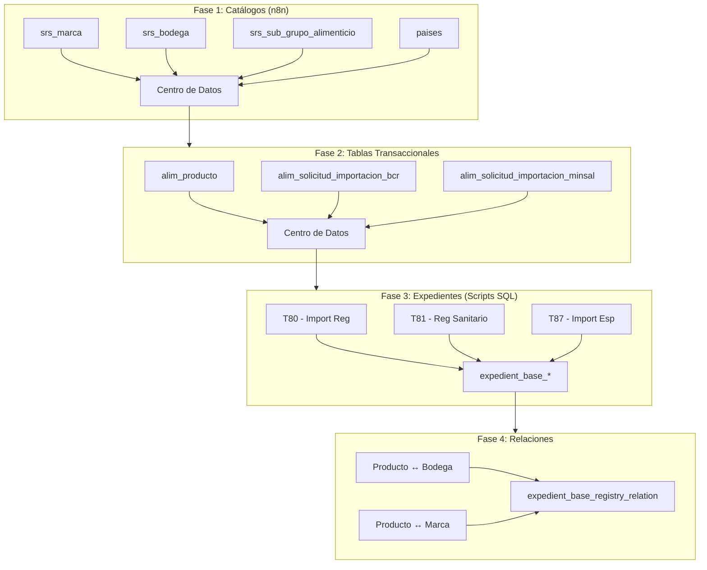
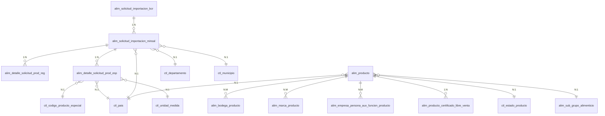

# Documento Ejecutivo: Migración Bloque 1 SRS

## Información General

| Atributo | Valor |
|----------|-------|
| **Bloque** | 1 - Sistema de Registro Sanitario (SRS) |
| **Unidad Responsable** | Superintendencia de Regulación Sanitaria |
| **Sistema Origen** | SISAM (PostgreSQL) |
| **Sistema Destino** | SDT (Core + Centro de Datos) |
| **Fecha del Documento** | 2026-02-03 |
| **Versión** | 1.0 |

---

## Resumen de Trámites

| Código | Trámite | Tipo | Estrategia | Estado |
|--------|---------|------|------------|--------|
| **T80** | Importación de Productos con Registro | EXPEDIENTE | Migración completa | 📋 Planeado |
| **T81** | Registro Sanitario Alimentos | EXPEDIENTE | Migración por batches | ✅ En desarrollo |
| **T87** | Importación de Productos Especiales | EXPEDIENTE | Migración completa | 📋 Planeado |

---

## Arquitectura de Migración

```
┌─────────────────────────────────────────────────────────────────────────┐
│                           SISTEMA ORIGEN (SISAM)                         │
│                                                                          │
│  PostgreSQL - Base de datos transaccional del registro sanitario         │
│  ┌──────────────────────────────────────────────────────────────────┐    │
│  │ alim_producto │ alim_solicitud_* │ alim_empresa │ ctl_* (catálogos)│   │
│  └──────────────────────────────────────────────────────────────────┘    │
└─────────────────────────────────────────────────────────────────────────┘
                                    │
                                    │ ETL (CSV + SQL Scripts + n8n)
                                    ▼
┌─────────────────────────────────────────────────────────────────────────┐
│                           SISTEMA DESTINO (SDT)                          │
│                                                                          │
│  ┌─────────────────────────────┐    ┌─────────────────────────────────┐ │
│  │     CORE Database          │    │     CENTRO DE DATOS Database    │ │
│  │                            │    │                                 │ │
│  │  expedient_base_entities   │    │  srs_marca                      │ │
│  │  expedient_base_registries │◄──►│  srs_bodega                     │ │
│  │  expedient_base_entity_    │    │  srs_sub_grupo_alimenticio      │ │
│  │    fields                  │    │  alim_producto                  │ │
│  │  expedient_base_registry_  │    │  alim_solicitud_importacion_bcr │ │
│  │    fields                  │    │  alim_solicitud_importacion_    │ │
│  │  expedient_base_registry_  │    │    minsal                       │ │
│  │    relation                │    │  paises                         │ │
│  └─────────────────────────────┘    └─────────────────────────────────┘ │
└─────────────────────────────────────────────────────────────────────────┘
```

---

## T80 - Importación de Productos con Registro

### Información del Trámite

| Atributo | Valor |
|----------|-------|
| **Código** | T80 |
| **Nombre** | Importación de Productos con Registro |
| **Tipo** | EXPEDIENTE |
| **Estrategia** | Migración completa (sin filtros) |
| **Entidad SDT** | Importación de Productos con Registro |

### Tablas Origen

| Tabla | Descripción | Cardinalidad |
|-------|-------------|--------------|
| `alim_solicitud_importacion_bcr` | Datos generales BCR | Principal |
| `alim_solicitud_importacion_minsal` | Datos específicos MINSAL | 1:1 con BCR |
| `alim_detalle_solicitud_prod_reg` | Detalle de productos registrados | 1:N |
| `ctl_unidad_medida` | Catálogo de unidades | N:1 |

### Mapeo de Campos - Solicitud

| Tabla Origen | Campo Origen | Campo SDT | Tipo Dato | Transformación |
|--------------|--------------|-----------|-----------|----------------|
| `alim_solicitud_importacion_bcr` | `numero_solicitud` | Número solicitud | TEXT | - |
| `alim_solicitud_importacion_bcr` | `fecha_registro_bcr` | Fecha registro BCR | DATE | DD/MM/YYYY |
| `alim_solicitud_importacion_bcr` | `nombre_importador` | Nombre importador | TEXT | TRIM |
| `alim_solicitud_importacion_bcr` | `nit_importador` | NIT importador | TEXT | - |
| `alim_solicitud_importacion_minsal` | `estado_solicitud` | Estado solicitud | SELECT | ENUM (1-5) |
| `alim_solicitud_importacion_minsal` | `fecha_registro_minsal` | Fecha registro MINSAL | DATE | DD/MM/YYYY |
| `alim_solicitud_importacion_minsal` | `fecha_resolucion_minsal` | Fecha solicitud MINSAL | DATE | DD/MM/YYYY |
| `alim_solicitud_importacion_minsal` | `nombre_tramitador` | Nombre del tramitador | TEXT | - |
| `alim_solicitud_importacion_minsal` | `tipo_de_documento_del_tramitador` | Tipo documento tramitador | TEXT | - |
| `alim_solicitud_importacion_minsal` | `numero_de_documento_del_tramitador` | Número documento tramitador | TEXT | - |
| `alim_solicitud_importacion_minsal` | `numero_solicitud_minsal` | Número solicitud MINSAL | TEXT | - |

### Mapeo de Campos - Productos

| Tabla Origen | Campo Origen | Campo SDT | Tipo Dato |
|--------------|--------------|-----------|-----------|
| `alim_detalle_solicitud_prod_reg` | `costo_producto` | Costo | NUMERIC |
| `alim_detalle_solicitud_prod_esp` | `cantidad_producto` | Unidad | NUMERIC |
| `ctl_unidad_medida` | `nombre` | Unidad de medida | TEXT |
| `alim_detalle_solicitud_prod_esp` | `id_ctl_unidad_medida` | id_unidad_medida | INTEGER |

---

## T81 - Registro Sanitario Alimentos

### Información del Trámite

| Atributo | Valor |
|----------|-------|
| **Código** | T81 |
| **Nombre** | Registro Sanitario Alimentos |
| **Tipo** | EXPEDIENTE |
| **Estrategia** | Migración por batches |
| **Volumen Estimado** | ~90,000 registros |
| **UUID Entidad SDT** | `af224c8b-ccdf-44ef-8e5d-58b8d7d70285` |

### Tablas Origen

| Tabla | Descripción | Cardinalidad |
|-------|-------------|--------------|
| `alim_producto` | Productos alimenticios | Principal |
| `ctl_pais` | Catálogo de países | N:1 |
| `ctl_estado_producto` | Estados del producto | N:1 |
| `alim_sub_grupo_alimenticio` | Sub-grupos alimenticios | N:1 |
| `ctl_clasificacion_grupo_alimenticio` | Clasificaciones | N:1 |
| `ctl_tipo_riesgo` | Tipos de riesgo | N:1 |
| `alim_bodega_producto` | Relación producto-bodega | N:M |
| `alim_certificado_libre_venta` | CLVs | 1:N |
| `alim_empresa_persona_aux` | Empresas y personas | N:M |

### Mapeo de Campos Principales (47 campos)

| # | Campo Origen | Campo SDT | Tipo | Sección |
|---|--------------|-----------|------|---------|
| 1 | `alim_producto.nombre` | Nombre del producto | TEXT | Datos generales |
| 2 | `alim_producto.num_registro_sanitario` | Número de registro sanitario | TEXT | Datos generales |
| 3 | `alim_producto.tipo_producto` | Tipo de producto | TEXT | Datos generales |
| 4 | `alim_producto.num_partida_arancelaria` | Partida arancelaria | TEXT | Datos generales |
| 5 | `alim_producto.fecha_emision_registro` | Fecha de emisión | DATE | Datos generales |
| 6 | `alim_producto.fecha_vigencia_registro` | Fecha de vigencia | DATE | Datos generales |
| 7 | `ctl_estado_producto.nombre` | Estado | TEXT | Datos generales |
| 8 | `alim_sub_grupo_alimenticio.nombre` | Subgrupo alimenticio | TEXT | Datos generales |
| 9 | `ctl_clasificacion_grupo_alimenticio.nombre` | Clasificación alimenticia | TEXT | Datos generales |
| 10 | `ctl_tipo_riesgo.nombre` | Riesgo | TEXT | Datos generales |
| 11 | `ctl_pais.nombre` | País de fabricación | TEXT | Datos generales |
| 12-14 | CLV campos | Código CLV, Nombre, País | TEXT | CLV |
| 15-20 | Propietario campos | Nombre, NIT, Correo, Dirección, País, Razón Social | TEXT | Propietario |
| 21-26 | Fabricante campos | Nombre, NIT, Correo, Dirección, País, Razón Social | TEXT | Fabricante |
| 27-32 | Distribuidor campos | Nombre, NIT, Correo, Dirección, País, Razón Social | TEXT | Distribuidor |
| 33-38 | Envasador campos | Nombre, NIT, Correo, Dirección, País, Razón Social | TEXT | Envasador |
| 39-44 | Importador campos | Nombre, NIT, Correo, Dirección, País, Razón Social | TEXT | Importador |
| 45-47 | IDs de relación | id_sub_grupo, id_pais, id_clv | TEXT | Relaciones |

### Transformaciones

| Campo | Transformación |
|-------|----------------|
| `tipo_producto` | 1→Nacional, 2→Importado UA, 3→Importado Otros |
| `estado_registro` | Solo migrar donde = 1 (activos) |
| `estado_producto` | UPPER(nombre) |

### Relaciones

| Relación | Tabla Destino Centro de Datos | Estrategia |
|----------|------------------------------|------------|
| Producto → Bodega | `srs_bodega` | `expedient_base_registry_relation` |
| Producto → Marca | `srs_marca` | `expedient_base_registry_relation` |
| Producto → Subgrupo | `srs_sub_grupo_alimenticio` | `expedient_base_registry_relation` |

---

## T87 - Importación de Productos Especiales

### Información del Trámite

| Atributo | Valor |
|----------|-------|
| **Código** | T87 |
| **Nombre** | Importación de Productos Especiales |
| **Tipo** | EXPEDIENTE |
| **Estrategia** | Migración completa (sin filtros) |
| **Entidad SDT** | Importación de Productos Especiales |

### Tablas Origen

| Tabla | Descripción | Cardinalidad |
|-------|-------------|--------------|
| `alim_solicitud_importacion_bcr` | Datos generales BCR | Principal |
| `alim_solicitud_importacion_minsal` | Datos específicos MINSAL | 1:1 con BCR |
| `alim_detalle_solicitud_prod_esp` | Detalle productos especiales | 1:N |
| `ctl_codigo_producto_especial` | Catálogo códigos producto | N:1 |
| `ctl_departamento` | Catálogo departamentos | N:1 |
| `ctl_municipio` | Catálogo municipios | N:1 |
| `ctl_tipo_documento_usuario` | Catálogo tipos documento | N:1 |
| `ctl_unidad_medida` | Catálogo unidades | N:1 |
| `ctl_pais` | Catálogo países | N:1 |

### Mapeo de Campos - Solicitud

| Tabla Origen | Campo Origen | Campo SDT | Tipo Dato | IS_REQUIRED |
|--------------|--------------|-----------|-----------|-------------|
| `alim_solicitud_importacion_bcr` | `nombre_importador` | Nombre importador | TEXT | FALSE |
| `alim_solicitud_importacion_bcr` | `nit_importador` | NIT importador | TEXT | FALSE |
| `alim_solicitud_importacion_bcr` | `fecha_registro_bcr` | Fecha registro BCR | DATE | FALSE |
| `alim_solicitud_importacion_bcr` | `numero_solicitud` | Número de solicitud | TEXT | FALSE |
| `alim_solicitud_importacion_minsal` | `estado_solicitud` | Estado de solicitud | SELECT | FALSE |
| `alim_solicitud_importacion_minsal` | `direccion_importador` | Dirección importador | TEXT | FALSE |
| `ctl_departamento` | `nombre` | Departamento | TEXT | FALSE |
| `ctl_municipio` | `nombre` | Municipio | TEXT | FALSE |
| `alim_solicitud_importacion_minsal` | `nombre_tramitador` | Nombre del tramitador | TEXT | FALSE |
| `ctl_tipo_documento_usuario` | `nombre` | Tipo documento del usuario | TEXT | FALSE |
| `alim_solicitud_importacion_minsal` | `numero_documento_tramitador` | Número documento | TEXT | FALSE |
| `ctl_pais` | `nombre` | País | TEXT | FALSE |
| `alim_solicitud_importacion_minsal` | `numero_solicitud_minsal` | Número solicitud MINSAL | TEXT | FALSE |
| `alim_solicitud_importacion_minsal` | `id_ctl_pais` | id_pais | TEXT | FALSE |
| `alim_solicitud_importacion_minsal` | `id_ctl_departamento` | id_departamento | TEXT | FALSE |
| `alim_solicitud_importacion_minsal` | `id_ctl_municipio` | id_municipio | TEXT | FALSE |
| `alim_solicitud_importacion_minsal` | `tipo_documento_tramitador` | id_tipo_documento_usuario | TEXT | FALSE |

### Mapeo de Campos - Productos

| Tabla Origen | Campo Origen | Campo SDT | Tipo Dato |
|--------------|--------------|-----------|-----------|
| `alim_detalle_solicitud_prod_esp` | `nombre_producto` | Nombre | TEXT |
| `alim_detalle_solicitud_prod_esp` | `marca_producto` | Marca | TEXT |
| `ctl_codigo_producto_especial` | `nombre` | Código producto especial | TEXT |
| `ctl_pais` | `nombre` | País | TEXT |
| `alim_detalle_solicitud_prod_esp` | `cantidad_producto` | Unidad medida | NUMERIC |
| `ctl_unidad_medida` | `nombre` | Unidad medida | TEXT |
| `alim_detalle_solicitud_prod_esp` | `costo_producto_importado` | Costo | NUMERIC |
| `alim_detalle_solicitud_prod_esp` | `id_ctl_codigo_producto_especial` | id_codigo_producto_especial | INTEGER |
| `alim_detalle_solicitud_prod_esp` | `id_ctl_pais` | id_pais | INTEGER |
| `alim_detalle_solicitud_prod_esp` | `id_ctl_unidad_medida` | id_unidad_medida | INTEGER |

---

## Catálogos Compartidos (Centro de Datos)

Las siguientes tablas se migran al **Centro de Datos** y son compartidas por todos los trámites del Bloque 1:

| Tabla Centro de Datos | Tabla Origen SISAM | Descripción | Estado |
|-----------------------|-------------------|-------------|--------|
| `srs_marca` | `ctl_marca` | Marcas comerciales | ✅ Migrado |
| `srs_bodega` | `alim_bodega` | Bodegas y almacenes | ✅ Migrado |
| `alim_producto` | `alim_producto` | Productos alimenticios | 📋 Planeado |
| `alim_solicitud_importacion_bcr` | `alim_solicitud_importacion_bcr` | Solicitudes BCR | 📋 Planeado |
| `alim_solicitud_importacion_minsal` | `alim_solicitud_importacion_minsal` | Solicitudes MINSAL | 📋 Planeado |
| `paises` | `ctl_pais` | Catálogo de países | ✅ Migrado |
| `srs_sub_grupo_alimenticio` | `alim_sub_grupo_alimenticio` | Subgrupos alimenticios | ✅ Migrado |
| `srs_material` | `ctl_material` | Materiales de envase | ✅ Migrado |
| `srs_unidad_medida` | `ctl_unidad_medida` | Unidades de medida | ✅ Migrado |

---

## Transformaciones Comunes

### Estado de Solicitud (ENUM - T80 y T87)

| Valor Original | Valor SDT | Descripción |
|----------------|-----------|-------------|
| 1 | Iniciada | Solicitud recién creada |
| 2 | Aprobada | Solicitud aprobada |
| 3 | Rechazada | Solicitud rechazada |
| 4 | Cancelada | Solicitud cancelada |
| 5 | En proceso | Solicitud en trámite |

### Estado Externo BCR

| Valor Original | Valor SDT |
|----------------|-----------|
| LA | Liquidado Aprobado |
| LD | Liquidado Denegado |
| ER | Espera de Respuesta |
| SE | Sin Estado |

### Tipo de Producto (T81)

| Valor Original | Valor SDT |
|----------------|-----------|
| 1 | Nacional |
| 2 | Importado de Union Aduanera |
| 3 | Importado de otros países |

---

## Flujo de Migración



---

## Scripts de Migración

| Script | Trámite | Descripción | Base de Datos |
|--------|---------|-------------|---------------|
| `Migrate_srs_marca_Cross_DB.json` | Todos | Workflow n8n para catálogos | Centro de Datos |
| `00_export_from_sisam.sql` | T81 | Exportar productos de SISAM | SISAM |
| `01_create_temp_table.sql` | T81 | Crear tabla temporal | Core |
| `02_migrate_from_temp.sql` | T81 | Migrar a expedient_base | Core |
| `03_migrate_by_entity_uuid.sql` | T81 | Migrar usando UUID existente | Core |
| `10_export_solicitud_importacion.sql` | T80/T87 | Exportar solicitudes | SISAM |
| `11_create_temp_table_solicitud_importacion.sql` | T80/T87 | Tabla temporal solicitudes | Core |
| `13_migrate_solicitud_importacion_by_uuid.sql` | T80/T87 | Migrar solicitudes | Core |

---

## Validaciones Post-Migración

### Queries de Verificación Global

```sql
-- Conteo de todas las tablas migradas en Centro de Datos
SELECT
  (SELECT COUNT(*) FROM srs_marca) as srs_marca,
  (SELECT COUNT(*) FROM srs_bodega) as srs_bodega,
  (SELECT COUNT(*) FROM alim_producto) as alim_producto,
  (SELECT COUNT(*) FROM alim_solicitud_importacion_bcr) as sol_import_bcr,
  (SELECT COUNT(*) FROM alim_solicitud_importacion_minsal) as sol_import_minsal;

-- Verificar registro en data_center_tables
SELECT name, description, created_at
FROM data_center_tables
WHERE name LIKE 'srs_%' OR name LIKE 'alim_%'
ORDER BY created_at DESC;
```

### Validación por Trámite

```sql
-- T81: Conteo de productos migrados
SELECT COUNT(*) as productos_migrados
FROM expedient_base_registries r
JOIN expedient_base_entities e ON e.id = r.expedient_base_entity_id
WHERE e.name = 'T81 - Registro Sanitario Alimentos';

-- T80/T87: Conteo de solicitudes
SELECT COUNT(*) as solicitudes_migradas
FROM migration_solicitud_importacion_temp;
```

---

## Cronograma Estimado

| Fase | Actividad | Duración | Dependencias |
|------|-----------|----------|--------------|
| 1 | Migración de catálogos (n8n) | 2 horas | - |
| 2 | Migración de tablas transaccionales | 1 hora | Fase 1 |
| 3.1 | T80 - Importación con Registro | 3 horas | Fase 2 |
| 3.2 | T81 - Registro Sanitario | 1 día | Fase 2 |
| 3.3 | T87 - Importación Especiales | 3 horas | Fase 2 |
| 4 | Relaciones y validaciones | 4 horas | Fase 3 |

---

## Contactos y Responsables

| Rol | Responsable | Área |
|-----|-------------|------|
| Líder Técnico | Por definir | Desarrollo |
| DBA | Por definir | Infraestructura |
| Data Engineer | Por definir | Migración |
| QA | Por definir | Calidad |
| Product Owner | Por definir | Negocio SRS |

---

## Anexos

### A. Diagrama ER Completo



### B. Consideraciones Especiales

1. **Sin filtros para T80 y T87**: Se migran TODOS los registros sin filtrar por estado
2. **Desnormalización**: Los catálogos se desnormalizan como TEXT para evitar JOINs
3. **legacy_id**: Formato `PRD-{id}`, `SOL-{id}` para trazabilidad
4. **Archivos**: Las rutas de archivos NO se migran en esta fase

---

**Documento generado**: 2026-02-03
**Versión**: 1.0
**Próxima revisión**: Por definir
