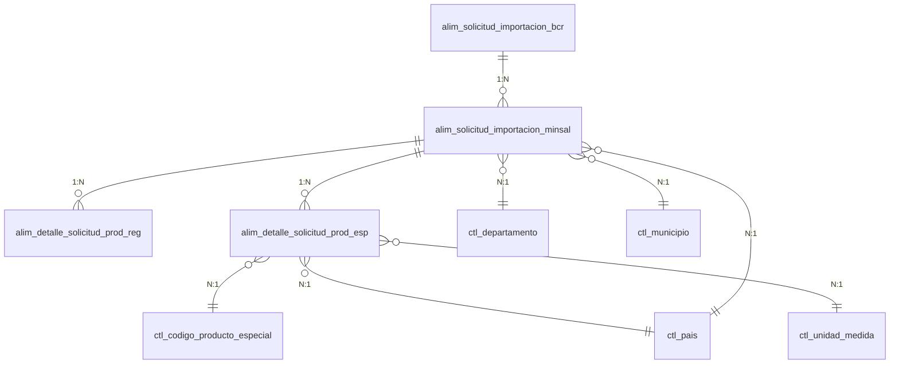

# Documento Ejecutivo: Migración de Trámites 80 y 87

## Resumen Ejecutivo

Este documento describe la estrategia de migración de datos desde SISAM hacia el Sistema de Digitalización de Trámites (SDT) para los trámites de importación de productos.

| Trámite | Nombre | Tipo | Estrategia |
|---------|--------|------|------------|
| **T80** | Importación de Productos con Registro | EXPEDIENTE | Migración completa |
| **T87** | Importación de Productos Especiales | EXPEDIENTE | Migración completa |

> **Nota**: Ambos trámites se migran **completamente**, sin filtros por estado ni segmentación por lotes.

---

## Trámite 80: Importación de Productos con Registro

### Entidad Principal

| Atributo | Valor |
|----------|-------|
| **Entidad** | Importación de Productos con Registro |
| **Tipo** | EXPEDIENTE |
| **Consideraciones** | Migración total sin filtros |

### Mapeo de Campos - Solicitud

| Tabla Origen | Campo Origen | Campo SDT | Tipo Dato | Transformación |
|--------------|--------------|-----------|-----------|----------------|
| `alim_solicitud_importacion_bcr` | `numero_solicitud` | Número solicitud | TEXT | - |
| `alim_solicitud_importacion_bcr` | `fecha_registro_bcr` | Fecha registro BCR | DATE | Formato DD/MM/YYYY |
| `alim_solicitud_importacion_bcr` | `nombre_importador` | Nombre importador | TEXT | TRIM |
| `alim_solicitud_importacion_bcr` | `nit_importador` | NIT importador | TEXT | Extraer texto |
| `alim_solicitud_importacion_minsal` | `estado_solicitud` | Estado solicitud | SELECT | 1: Iniciada, 2: Aprobada, 3: Rechazada, 4: Cancelada, 5: En proceso |
| `alim_solicitud_importacion_minsal` | `fecha_registro_minsal` | Fecha registro MINSAL | DATE | Formato DD/MM/YYYY |
| `alim_solicitud_importacion_minsal` | `fecha_resolucion_minsal` | Fecha solicitud MINSAL | DATE | Formato DD/MM/YYYY |
| `alim_solicitud_importacion_minsal` | `nombre_tramitador` | Nombre del tramitador | TEXT | - |
| `alim_solicitud_importacion_minsal` | `tipo_de_documento_del_tramitador` | Tipo de documento del tramitador | TEXT | - |
| `alim_solicitud_importacion_minsal` | `numero_de_documento_del_tramitador` | Número de documento del tramitador | TEXT | - |
| `alim_solicitud_importacion_minsal` | `numero_solicitud_minsal` | Número solicitud MINSAL | TEXT | - |

### Mapeo de Campos - Productos

| Tabla Origen | Campo Origen | Campo SDT | Tipo Dato | Transformación |
|--------------|--------------|-----------|-----------|----------------|
| `alim_detalle_solicitud_prod_reg` | `costo_producto` | Costo | NUMERIC | - |
| `alim_detalle_solicitud_prod_esp` | `cantidad_producto` | Unidad | NUMERIC | - |
| `ctl_unidad_medida` | `nombre` | Unidad de medida | TEXT | Desnormalizar |
| `alim_detalle_solicitud_prod_esp` | `id_ctl_unidad_medida` | id unidad medida | INTEGER | FK reference |

### Tablas Origen Involucradas

```
SISAM
├── alim_solicitud_importacion_bcr      (Datos generales BCR)
├── alim_solicitud_importacion_minsal   (Datos específicos MINSAL)
├── alim_detalle_solicitud_prod_reg     (Detalle productos registrados)
├── ctl_unidad_medida                   (Catálogo unidad medida)
└── ctl_pais                            (Catálogo países)
```

---

## Trámite 87: Importación de Productos Especiales

### Entidad Principal

| Atributo | Valor |
|----------|-------|
| **Entidad** | Importación de Productos Especiales |
| **Tipo** | EXPEDIENTE |
| **Consideraciones** | Migración total sin filtros |

### Mapeo de Campos - Solicitud

| Tabla Origen | Campo Origen | Campo SDT | Tipo Dato | IS_REQUIRED | Transformación |
|--------------|--------------|-----------|-----------|-------------|----------------|
| `alim_solicitud_importacion_bcr` | `nombre_importador` | Nombre importador | TEXT | FALSE | TRIM |
| `alim_solicitud_importacion_bcr` | `nit_importador` | NIT importador | TEXT | FALSE | - |
| `alim_solicitud_importacion_bcr` | `fecha_registro_bcr` | Fecha registro BCR | DATE | FALSE | Formato DD/MM/YYYY |
| `alim_solicitud_importacion_bcr` | `numero_solicitud` | Número de solicitud | TEXT | FALSE | Extraer texto |
| `alim_solicitud_importacion_minsal` | `estado_solicitud` | Estado de solicitud | SELECT | FALSE | 1: Iniciada, 2: Aprobada, 3: Rechazada, 4: Cancelada, 5: En proceso |
| `alim_solicitud_importacion_minsal` | `direccion_importador` | Dirección importador | TEXT | FALSE | - |
| `ctl_departamento` | `nombre` | Departamento | TEXT | FALSE | Desnormalizar |
| `ctl_municipio` | `nombre` | Municipio | TEXT | FALSE | Desnormalizar |
| `alim_solicitud_importacion_minsal` | `nombre_tramitador` | Nombre del tramitador | TEXT | FALSE | - |
| `ctl_tipo_documento_usuario` | `nombre` | Tipo documento del usuario | TEXT | FALSE | Desnormalizar |
| `alim_solicitud_importacion_minsal` | `numero_documento_tramitador` | Número documento del tramitador | TEXT | FALSE | - |
| `ctl_pais` | `nombre` | País | TEXT | FALSE | Desnormalizar |
| `alim_solicitud_importacion_minsal` | `numero_solicitud_minsal` | Número solicitud MINSAL | TEXT | FALSE | - |
| `alim_solicitud_importacion_minsal` | `id_ctl_pais` | id_pais | TEXT | FALSE | FK reference |
| `alim_solicitud_importacion_minsal` | `id_ctl_departamento` | id_departamento | TEXT | FALSE | FK reference |
| `alim_solicitud_importacion_minsal` | `id_ctl_municipio` | id_municipio | TEXT | FALSE | FK reference |
| `alim_solicitud_importacion_minsal` | `tipo_documento_tramitador` | id_tipo_documento_usuario | TEXT | FALSE | FK reference |

### Mapeo de Campos - Productos

| Tabla Origen | Campo Origen | Campo SDT | Tipo Dato | Transformación |
|--------------|--------------|-----------|-----------|----------------|
| `alim_detalle_solicitud_prod_esp` | `nombre_producto` | Nombre | TEXT | - |
| `alim_detalle_solicitud_prod_esp` | `marca_producto` | Marca | TEXT | - |
| `ctl_codigo_producto_especial` | `nombre` | Código producto especial | TEXT | Desnormalizar |
| `ctl_pais` | `nombre` | País | TEXT | Desnormalizar |
| `alim_detalle_solicitud_prod_esp` | `cantidad_producto` | Unidad medida | NUMERIC | - |
| `ctl_unidad_medida` | `nombre` | Unidad medida | TEXT | Desnormalizar |
| `alim_detalle_solicitud_prod_esp` | `costo_producto_importado` | Costo | NUMERIC | - |
| `alim_detalle_solicitud_prod_esp` | `id_ctl_codigo_producto_especial` | id_codigo_producto_especial | INTEGER | FK reference |
| `alim_detalle_solicitud_prod_esp` | `id_ctl_pais` | id_pais | INTEGER | FK reference |
| `alim_detalle_solicitud_prod_esp` | `id_ctl_unidad_medida` | id_unidad_medida | INTEGER | FK reference |

### Tablas Origen Involucradas

```
SISAM
├── alim_solicitud_importacion_bcr      (Datos generales BCR)
├── alim_solicitud_importacion_minsal   (Datos específicos MINSAL)
├── alim_detalle_solicitud_prod_esp     (Detalle productos especiales)
├── ctl_codigo_producto_especial        (Catálogo códigos productos)
├── ctl_departamento                    (Catálogo departamentos)
├── ctl_municipio                       (Catálogo municipios)
├── ctl_tipo_documento_usuario          (Catálogo tipos documento)
├── ctl_unidad_medida                   (Catálogo unidad medida)
└── ctl_pais                            (Catálogo países)
```

---

## Estrategia de Migración

### Enfoque General


### Pasos de Ejecución

| Paso | Acción | Script | Destino |
|------|--------|--------|---------|
| 1 | Exportar datos de SISAM | `10_export_solicitud_importacion.sql` | CSV |
| 2 | Crear tabla temporal en CORE | `11_create_temp_table_solicitud_importacion.sql` | CORE DB |
| 3 | Migrar registros | `13_migrate_solicitud_importacion_by_uuid.sql` | Centro de Datos |
| 4 | Registrar en catálogo | INSERT en `data_center_tables` | SDT DB |

### Volumen Estimado

| Tabla | Registros Estimados |
|-------|---------------------|
| `alim_solicitud_importacion_bcr` | Por consultar |
| `alim_solicitud_importacion_minsal` | Por consultar |
| `alim_detalle_solicitud_prod_reg` | Por consultar |
| `alim_detalle_solicitud_prod_esp` | Por consultar |

---

## Transformaciones de Datos

### Estado de Solicitud (ENUM)

| Valor Original | Valor SDT |
|----------------|-----------|
| 1 | Iniciada |
| 2 | Aprobada |
| 3 | Rechazada |
| 4 | Cancelada |
| 5 | En proceso |

### Estado Externo BCR

| Valor Original | Valor SDT |
|----------------|-----------|
| LA | Liquidado Aprobado |
| LD | Liquidado Denegado |
| ER | Espera de Respuesta |
| SE | Sin Estado |

### Desnormalización de Catálogos

Los siguientes catálogos se desnormalizan (se almacena el nombre en lugar del ID):

- `ctl_pais` → País (nombre)
- `ctl_departamento` → Departamento (nombre)
- `ctl_municipio` → Municipio (nombre)
- `ctl_tipo_documento_usuario` → Tipo documento (nombre)
- `ctl_unidad_medida` → Unidad de medida (nombre)
- `ctl_codigo_producto_especial` → Código producto especial (nombre)

---

## Dependencias entre Tablas



---

## Validaciones Post-Migración

### Queries de Verificación

```sql
-- Conteo total de solicitudes migradas
SELECT COUNT(*) as total_solicitudes
FROM migration_solicitud_importacion_temp;

-- Distribución por estado
SELECT estado_de_solicitud, COUNT(*) as total
FROM migration_solicitud_importacion_temp
GROUP BY estado_de_solicitud
ORDER BY total DESC;

-- Verificar campos nulos críticos
SELECT
    'nombre_importador NULL' as campo,
    COUNT(*) as total
FROM migration_solicitud_importacion_temp
WHERE nombre_importador IS NULL OR nombre_importador = '';
```

---

## Contacto y Responsables

| Rol | Responsable |
|-----|-------------|
| DBA | Por definir |
| Desarrollo | Por definir |
| QA | Por definir |

---

**Documento generado**: 2026-02-03
**Versión**: 1.0
